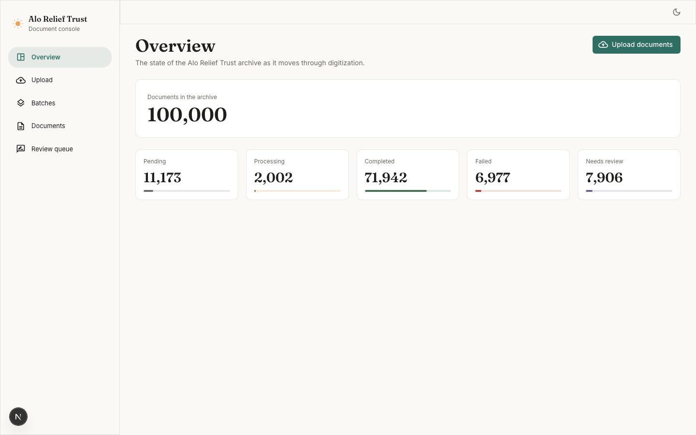
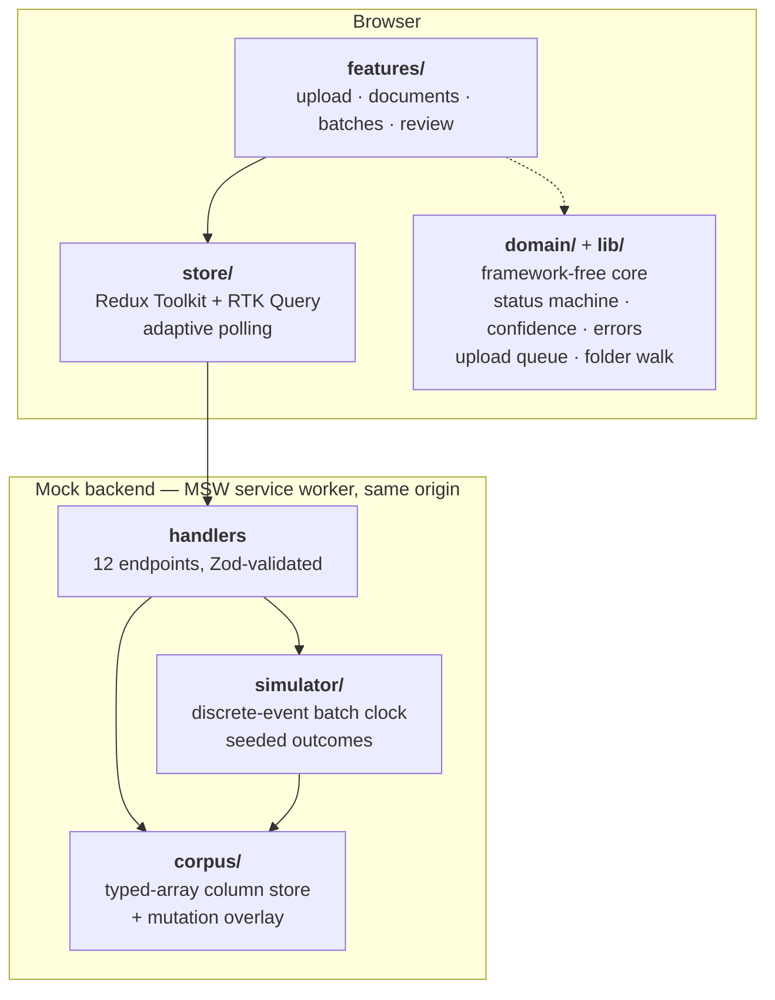
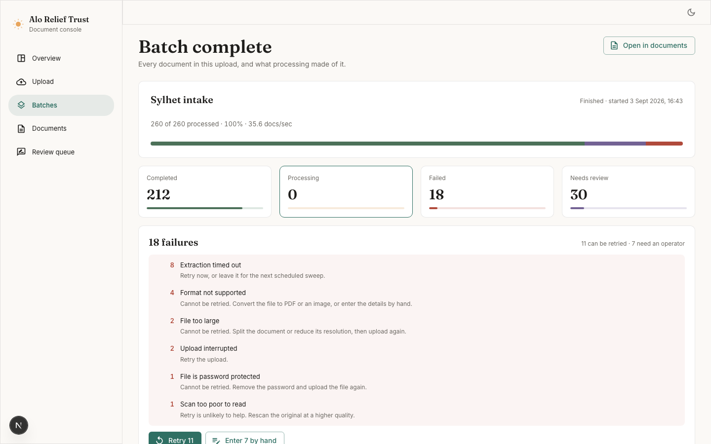
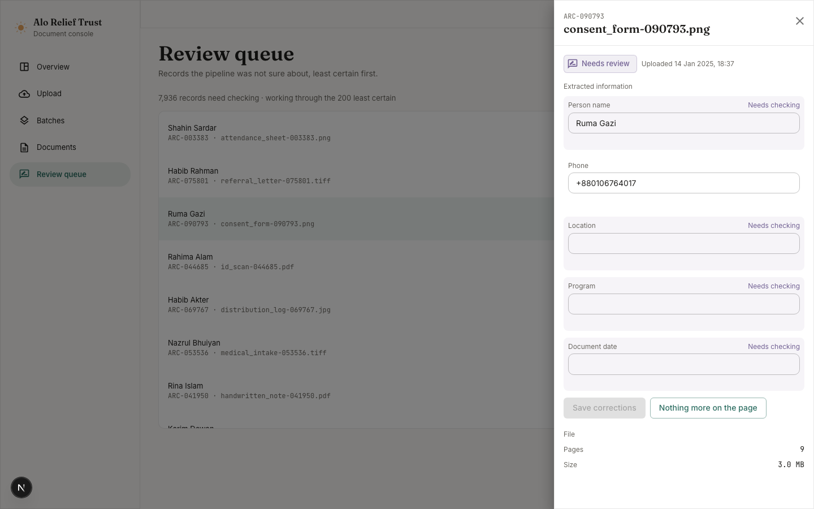

# Alo Relief Trust — Document Console

A console for digitizing an NGO's paper archive: bulk upload, honest progress, and a way to
resolve the records the extraction pipeline got wrong or was unsure about.

Built as a frontend prototype against a mock backend. Everything runs in the browser — there is
no server to stand up.



---

## Running it

```bash
pnpm install
pnpm dev            # http://localhost:3000
```

Built and verified on Node 22.15 and pnpm 9.15 (`.nvmrc` pins the major). No environment variables, no services, no seeding step: the archive of
100,000 documents is generated in the browser on first load.

```bash
pnpm test           # 409 unit and component tests
pnpm bench          # the performance numbers quoted below
pnpm typecheck      # next typegen && tsc --noEmit
pnpm lint
pnpm build
```

### Deploying

A standard Next.js app — no environment variables and no backing services, because the API is a
service worker inside the browser:

```bash
pnpm build && pnpm start     # or deploy to Vercel, which needs no configuration
```

`public/mockServiceWorker.js` has to be served from the origin root. It is committed, so a
default deploy already does that.

Not a static export: `/batches/[batchId]` is a dynamic route whose ids only exist at runtime.

---

## Assumptions

The brief is deliberately under-specified, so these are the calls I made. Each one is a place a
real product decision would be made with the operations team.

| #   | Assumption                                                                                                       | Why it matters                                                                                                |
| --- | ---------------------------------------------------------------------------------------------------------------- | ------------------------------------------------------------------------------------------------------------- |
| 1   | **The operator is not a developer.** A field officer digitizing intake forms, working through a queue for hours. | Drives the calm palette, the density toggle, and error copy that names a remedy rather than a code.           |
| 2   | **The archive already exists; uploads add to it.** 100,000 documents are already there, in every state.          | The app has to be useful on first load, not only after you upload something.                                  |
| 3   | **Extraction is routinely incomplete, not occasionally broken.** ~9% need review, ~7% fail.                      | Uncertainty is a first-class state in the model, not an error path.                                           |
| 4   | **Confidence belongs to a field, not a document.**                                                               | A record can be perfectly readable except for a phone number. Averaging that away presents a guess as a fact. |
| 5   | **Not every failure is worth retrying.** An unsupported format will fail identically forever.                    | Retry is offered per cause, and failures a retry cannot clear get a different route out.                      |
| 6   | **A batch is rarely simply done or failed.**                                                                     | Progress is reported as a four-way split, not a percentage.                                                   |
| 7   | **The backend would be real.** Polling stands in for what would be SSE or a WebSocket.                           | Called out below rather than hidden.                                                                          |

---

## Architecture



Four rules the code follows:

- **`domain/` and `lib/` import nothing from React, MUI or Redux.** The status machine, the
  confidence bands, the error taxonomy, the upload queue and the folder walk are plain
  TypeScript, and are where most of the tests live.
- **Routes are thin.** Every page is a few lines that render one feature component.
- **The mock backend is a real backend.** It validates with Zod, returns proper status codes,
  and is deliberately reachable in the network tab. The client has no idea it is fake.
- **MUI owns components; Tailwind owns layout.** Never both on the same property. CSS cascade
  layers (`@layer mui, app, tw-theme, tw-utilities`) make the precedence explicit rather than
  a matter of import order.

---

## The 100,000 document problem

Holding 100,000 rich objects in memory is ~100 MB and a multi-second boot. So the archive is
not stored as objects at all.

```
pnpm gen:pools    Faker, fixed seed, at build time → small dictionaries
                  2,000 names · 192 locations · 12 programs · 8 document types
                              ↓
Boot              typed-array column store, 12 columns
                  Uint8Array status · Float32Array confidence · Uint32Array nameId → pool
                              ↓
Query             filter and sort walk the columns, writing row indices into a Uint32Array
                              ↓
Page              only the ~50 visible rows are materialized into objects
```

`documentAt(seed, index)` is a **pure function**: the archive is addressable rather than
stored. Mutations — uploads, retries, corrections — live in a small overlay `Map`, and a read
is `base ∪ overlay`.

### Measured, not estimated

`pnpm bench`, 100,000 documents, on an M-series laptop:

|                                             |                                           |
| ------------------------------------------- | ----------------------------------------- |
| Column store, exact                         | **2.96 MB** — 31.0 bytes per document     |
| The same archive as objects                 | **~100 MB** — roughly a **30× reduction** |
| Build the store at boot                     | **~125 ms**                               |
| Filter the full archive                     | **1.8 ms**                                |
| Filter + sort + page of 50 (71,942 matches) | **23 ms**                                 |
| Free-text search across pooled names        | **5.5 ms**                                |
| Read one page of 50 summaries               | **0.3 ms**                                |

The store size is exact, read off `byteLength`. The object comparison is a heap measurement and
genuinely noisy — a single sample swung between 25× and 38× — so the benchmark holds a real
sample of 20,000 records, repeats five times, and prints the median with the spread beside it.
Quoting one flattering run would have been easy and wrong.

Ingest, measured in the browser with the page building the files itself so the number is the
app's work and not the test harness's:

|                                    |                                  |
| ---------------------------------- | -------------------------------- |
| Index 20,000 dropped files         | **56 ms**                        |
| Longest gap between painted frames | **35 ms** — the page never froze |

The folder walk is chunked with `scheduler.yield()` and is cancellable, which is what keeps
that gap small. A naive recursive walk holds the main thread for seconds: no paint, no scroll,
no cancel button.

Client JavaScript for the whole app, all route chunks, gzipped: **659 KB**. MUI X DataGrid and
the MUI/Emotion runtime dominate it; see _what I would do with more time_.

---

## The data model

```ts
type ExtractedField<T> = {
  value?: T; // absent is a real state, not an empty string
  confidence: number; // per field, never averaged to the document
  source: 'ocr' | 'ml' | 'manual'; // a corrected value is trusted absolutely
};
```

A document moves along a state machine, and only along it:

```
pending → processing → completed
                     → failed        → processing      (retry)
                                     → needs_review    (a retry cannot fix it; a person will)
                     → needs_review  → completed       (checked or corrected)
                                     → processing
```

`completed` is terminal. Every other edge is enumerated in `domain/status.ts` and tested; an
illegal transition is a bug upstream, not something the UI should paper over.

**Failures carry their own taxonomy.** Seven codes, each with a cause, a remedy and whether a
retry could plausibly help:

| Code                                                         | Retryable      | What the operator is offered         |
| ------------------------------------------------------------ | -------------- | ------------------------------------ |
| `ocr_timeout`, `network_error`                               | yes            | Retry                                |
| `unreadable_scan`, `low_text_density`                        | yes, low value | Retry, with the caveat stated        |
| `unsupported_format`, `file_too_large`, `password_protected` | **no**         | Hand it to a person to enter by hand |

---

## Decisions, and what lost

| Decision                                     | Alternatives rejected                                    | Why                                                                                                                                                                            |
| -------------------------------------------- | -------------------------------------------------------- | ------------------------------------------------------------------------------------------------------------------------------------------------------------------------------ |
| Typed-array column store                     | Array of 100k objects; IndexedDB; server pagination only | Roughly 30× less memory, measured. IndexedDB adds async everywhere for data that is regenerated on boot anyway.                                                                |
| Corpus as a pure function of `(seed, index)` | Generate and keep                                        | The archive is addressable. Deterministic across reloads, so a bug reproduces.                                                                                                 |
| MSW service worker                           | A stubbed fetch layer or fixtures                        | Requests appear in the network tab, and the client contains no test-only branches.                                                                                             |
| Adaptive polling that stops on settle        | Fixed interval; SSE                                      | A fixed interval refetches forever after a batch finishes. Idle polling measured at **0 requests**. SSE is the right answer against a real backend, and is what I would build. |
| Framework-free upload queue                  | A library; `Promise.all` with a semaphore                | Exactly N workers pull from one shared list, so the concurrency limit is structural rather than a counter that must be decremented correctly on every error and cancel path.   |
| Batch progress split four ways               | One percentage                                           | A single bar hides the failures inside the same green that reports success.                                                                                                    |
| One `PATCH` per correction pass              | One request per field                                    | An operator fixing three fields should not produce three round-trips and an audit trail that reads as three separate visits.                                                   |
| Persist preferences only                     | Persist the RTK Query cache                              | The backend is in-memory. A restored cache would render batches the server no longer has.                                                                                      |
| URL as the grid's state                      | Component state; a store slice                           | Filtered views are shareable, survive a refresh, and get browser back/forward for free. Parsed with Zod, because a URL is user-editable.                                       |
| Hand-rolled virtualization                   | `react-window` / `react-virtual`                         | ~60 lines against a new dependency, for a list with fixed-height rows.                                                                                                         |

---

## Failure and uncertainty

These are the two places the brief actually asks for judgment, so they are where most of the
product thinking went.

**Failures are grouped by cause, never counted.** "19 failed" behind one retry button is
dishonest when seven of them are unsupported formats no retry can clear. The split is what
lets both actions state real numbers, and each cause opens exactly those documents.



**A failure a retry cannot fix is not a dead end.** It can be handed to an operator, and the
document keeps its error code so the review task explains why it has to be typed. The reverse
is refused: an operator's time is the expensive resource.

**Uncertain records get a queue, ordered by the pipeline's own uncertainty** — least certain
first, because an operator with an hour should spend it there. Every field is editable, not
only the flagged ones, since extraction can be confidently wrong.



**Every field may be left empty.** A page that genuinely carries no phone number is a fact
about the document; a form that refused to save without one would push an operator into
inventing data. Confirming a record is recorded as a correction at the value already there, so
the audit trail shows a person checked it rather than the flag quietly disappearing.

---

## Accessibility

Verified by keyboard and by reading the accessibility tree, not asserted:

- **Progress is announced on the tens, never on every tick.** A live region that updates per
  file makes a screen reader unusable on a long run — the reader restarts mid-sentence and the
  operator never hears a whole one. The finish is always announced, because that is the update
  worth interrupting for.
- **Status is icon + text + colour, never colour alone.**
- **Contrast is enforced by a test.** `theme/contrast.test.ts` computes WCAG ratios for every
  token pair, including each status ink against its own tinted chip, and fails below 4.5:1 for
  text and 3:1 for meaningful graphics. My first palette failed all five statuses; the test is
  why that could not survive.
- **Form errors are tied to their inputs** through `aria-describedby` and `aria-invalid`, so
  the message is announced with the field.
- **The detail drawer is a real dialog** — focus trapped, focus restored on close, Escape
  closes, and an explicit `role="dialog"`.
- **A visible focus ring is unconditional**, set in the app layer rather than relying on
  component defaults.
- `prefers-reduced-motion` disables every transition.

---

## Testing

**409 tests across 25 files.** Coverage of `domain/`, `lib/` and `server/` is **89% of
statements**.

The weight is deliberately on the framework-free core — the state machine, the query engine,
the discrete-event simulator, the upload queue's concurrency, backoff, pause and cancel — and
on the seams where things actually broke. Component tests cover the correction form's keyboard
traverse and error wiring.

Two habits worth naming:

- **A regression test is not finished until it has been seen to fail.** When a retry turned out
  to be emptying batches, the existing test (`expect(after).toBeLessThan(before)`) passed
  happily, because it is trivially true when documents vanish. Every regression test for that
  bug was run against the old code first to confirm it caught it.
- **Green tests are not evidence the app works.** Several real defects — a request racing the
  service worker, a drawer that was not a dialog, a confirmation that unmounted itself on
  success — were only ever visible by driving the browser.

---

## What I would do with more time

**In priority order.**

1. **Replace polling with SSE or a WebSocket.** Adaptive polling is the honest workaround for a
   mock backend, not the design.
2. **Cut the bundle.** 659 KB gzipped is more than this UI needs. MUI X DataGrid is most of it,
   and the grid uses a fraction of its features — a smaller table over the existing
   virtualization would likely halve the total.
3. **Move corpus generation and querying into a Worker.** The 23 ms full query is fine, but
   it is on the main thread; at a million documents it would not be.
4. **Persist the archive to IndexedDB**, so a reload does not start over. The in-memory backend
   is the reason a batch link dies on refresh — the app says so plainly rather than pretending.
5. **Bulk correction.** Corrections are per document; a queue of 7,900 wants "apply to all
   matching".
6. **Real E2E coverage.** Playwright is configured and the flows are scripted, but the suite is
   thin next to the unit tests.
7. **A confirm-and-advance flow in the review queue** — saving should move to the next record,
   because that is how a queue is actually worked.

### Known limits, stated plainly

- Batches live in memory, so a page reload starts a fresh archive. The batch page says exactly
  that rather than implying the batch failed.
- The review queue works the 200 least certain records rather than paging all of them.
- Bulk retry is per batch; a cross-batch action would need a different endpoint.
- Console `503`s during upload are a deliberately injected transient failure rate, so retry and
  backoff are exercised against something real. The rate is a simulator setting.

---

## Screens

|                   | Light                                                  | Dark                                                  |
| ----------------- | ------------------------------------------------------ | ----------------------------------------------------- |
| Overview          | [png](.github/screenshots/overview-light.png)          | [png](.github/screenshots/overview-dark.png)          |
| Upload            | [png](.github/screenshots/upload-light.png)            | [png](.github/screenshots/upload-dark.png)            |
| Ready to upload   | [png](.github/screenshots/upload-summary-light.png)    | [png](.github/screenshots/upload-summary-dark.png)    |
| Upload queue      | [png](.github/screenshots/upload-queue-light.png)      | [png](.github/screenshots/upload-queue-dark.png)      |
| Batch in progress | [png](.github/screenshots/batch-running-light.png)     | [png](.github/screenshots/batch-running-dark.png)     |
| Batch monitor     | [png](.github/screenshots/batch-settled-light.png)     | [png](.github/screenshots/batch-settled-dark.png)     |
| Documents         | [png](.github/screenshots/documents-light.png)         | [png](.github/screenshots/documents-dark.png)         |
| Document detail   | [png](.github/screenshots/document-detail-light.png)   | [png](.github/screenshots/document-detail-dark.png)   |
| Review queue      | [png](.github/screenshots/review-queue-light.png)      | [png](.github/screenshots/review-queue-dark.png)      |
| Correction        | [png](.github/screenshots/review-correction-light.png) | [png](.github/screenshots/review-correction-dark.png) |

---

## Design

The console is warm where almost every operational dashboard is cold grey-blue. _Alo_ (আলো) is
Bengali for **light**, and these are not server logs — they are enrollment forms, medical
intake sheets and ID scans belonging to real people, handled by an operator doing patient,
high-volume work for hours.

Fraunces for display figures, Inter for the interface, JetBrains Mono with tabular figures for
identifiers and counts so numbers do not jitter as they tick up. Motion is slow, and only ever
communicates a state change.
